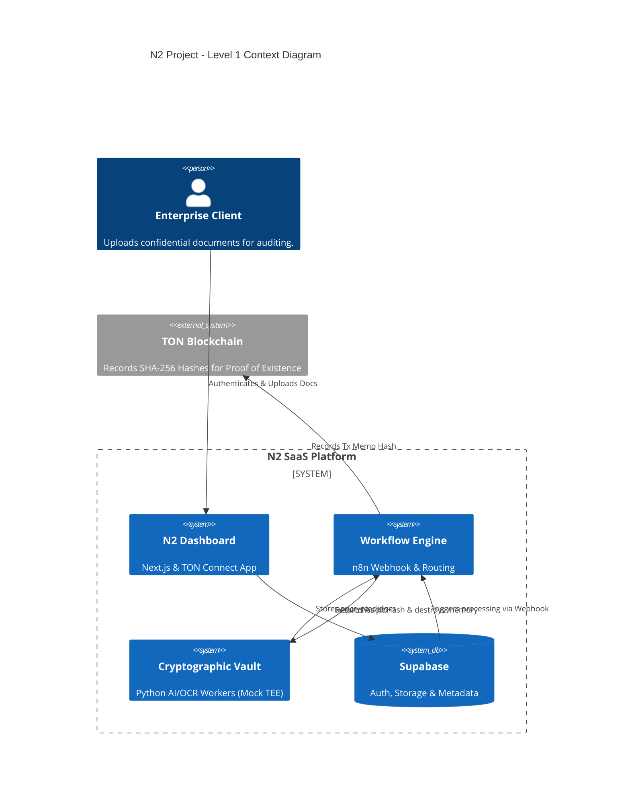

<div align="center">

# 🛡️ N2: Document Audit Vault & Clean Room

_An ultra-secure B2B SaaS utilizing Mocked Trusted Execution Environments (TEEs) for Confidential AI Document Processing, anchored on The Open Network (TON)._

[]()
[]()
[]()
[]()
[]()

</div>

---

## 🎯 The Why

In high-stakes sectors like Legal and Pharma, the traditional cloud model poses an unacceptable risk. When processing highly confidential data—such as M&A contracts or clinical records—sending plain text to a centralized provider exposes corporations to data breaches, compliance violations, and industrial espionage.

**N2** solves this by operating as a "Digital Clean Room." By wrapping AI and OCR execution in Mocked Trusted Execution Environments (TEEs), N2 ensures that not even the system administrators can view the data being processed. It brings the power of massive GPU clusters (via networks like Cocoon) to your documents, without compromising secrecy. Finally, the unforgeable proof of processing is anchored on the TON blockchain, guaranteeing complete auditability.

---

## 🚀 Quick Start

Get the entire infrastructure running locally with one command:

```bash
# Spin up the backend (Supabase, n8n, Python Workers in isolated mock enclaves)
docker-compose up -d --build

# Run the frontend
cd frontend
npm install
npm run dev
```

🌐 Open [http://localhost:3000](http://localhost:3000) to view the Dashboard.

---

## 🏗️ Architecture at a Glance



👉 **Dive deeper into the architecture:** Read our [Architecture Guide](docs/explanation/architecture.md).

---

## 📚 Documentation

Our documentation follows the [Diátaxis](https://diataxis.fr/) framework:

- 🏫 **Tutorials:** (Coming Soon)
- 🛠️ **How-To Guides:**
  - [Local Setup & Execution](docs/how-to/local-setup.md)
- 📖 **Reference:**
  - [API Endpoints](docs/reference/api.md)
  - [Database Schema](docs/reference/database-schema.md)
- 🧠 **Explanation:**
  - [Architecture In-Depth](docs/explanation/architecture.md)
  - [Cocoon Network Research Report](docs/explanation/cocoon-research-report.md)

---

## 📜 Roadmap & History

- [x] Initial Next.js Frontend Setup
- [x] Python TEE Mock Worker Initialization
- [x] Supabase Database & Auth Implementation
- [ ] Complete n8n workflow integration
- [ ] Stripe Pay-As-You-Go Billing
- [ ] Migrate Mock TEE to AWS Nitro Enclaves

---

<div align="center">
<i>"If it isn't documented, it doesn't exist." - ✍️ Scribe</i>
</div>
