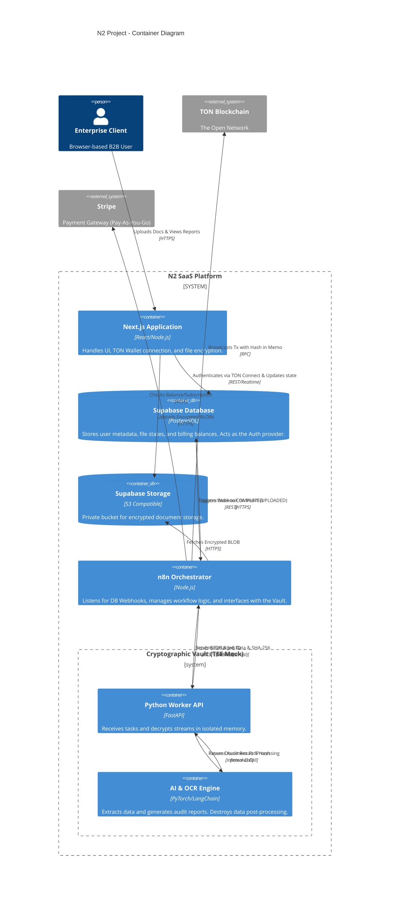
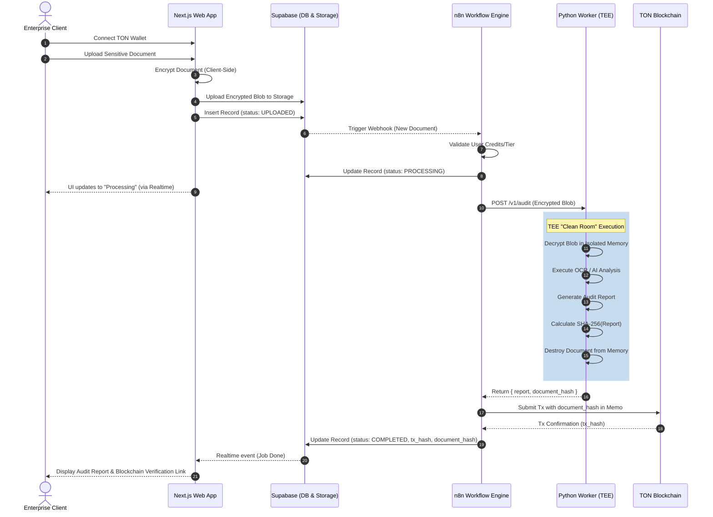

# Architecture In-Depth

This document details the architectural decisions and flow of the N2 Project, moving from the high-level system context down to the specific interactions between containers and external dependencies.

## C4 Container Diagram (Level 2)

This diagram breaks down the N2 Platform into its deployable containers and showcases how data flows between the Web App, the Orchestrator, and the TEE Mock Vault.

## Business Logic Flow: Document Upload to On-Chain Recording

The following sequence diagram outlines the chronological steps taken by the system when a user submits a highly sensitive document. Note the emphasis on the "Clean Room" lifecycle within the Python Worker.

