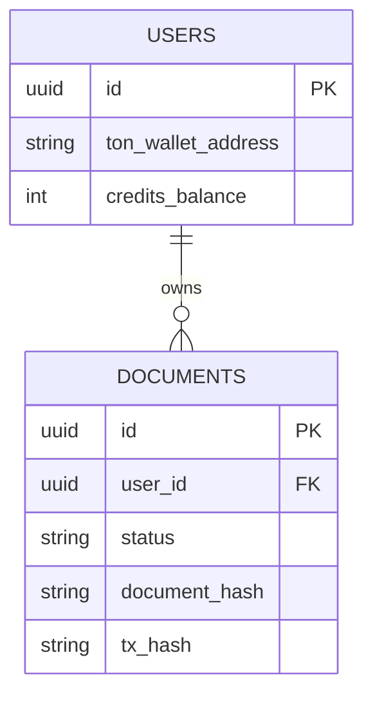

# Database Schema Reference

The primary database for the N2 Platform is PostgreSQL, managed via Supabase. The schema is designed for multi-tenancy and the Pay-As-You-Go monetization model.

## Core Tables

### `documents`

Tracks the lifecycle of an uploaded document, from initialization to on-chain recording.

| Column          | Type                 | Description                                                                     |
| :-------------- | :------------------- | :------------------------------------------------------------------------------ |
| `id`            | `UUID` (Primary Key) | Unique identifier for the audit job.                                            |
| `user_id`       | `UUID` (Foreign Key) | Reference to the `users` table or TON Wallet ID.                                |
| `file_name`     | `VARCHAR(255)`       | Original (or masked) name of the uploaded document.                             |
| `storage_path`  | `TEXT`               | Path to the encrypted blob in Supabase Storage.                                 |
| `status`        | `ENUM`               | Current state: `UPLOADED`, `PROCESSING`, `COMPLETED`, `FAILED`.                 |
| `document_hash` | `VARCHAR(64)`        | The SHA-256 hash of the generated audit report (Generated by TEE Worker).       |
| `tx_hash`       | `VARCHAR(128)`       | The TON Blockchain transaction hash containing the `document_hash` in its memo. |
| `created_at`    | `TIMESTAMP`          | Time the document was uploaded.                                                 |
| `updated_at`    | `TIMESTAMP`          | Last time the row was updated.                                                  |

### `users` (or `accounts`)

Stores client information, Wallet details, and billing balances.

| Column               | Type                 | Description                                        |
| :------------------- | :------------------- | :------------------------------------------------- |
| `id`                 | `UUID` (Primary Key) | Unique user ID.                                    |
| `ton_wallet_address` | `VARCHAR(64)`        | The connected TON wallet address for Web3 Auth.    |
| `stripe_customer_id` | `VARCHAR(255)`       | Reference to the Stripe customer for fiat billing. |
| `credits_balance`    | `INTEGER`            | Current Pay-As-You-Go credit balance for auditing. |
| `created_at`         | `TIMESTAMP`          | Account creation date.                             |

## Relationships

## Realtime Triggers

Supabase is configured with Realtime triggers on the `documents` table.
When `status` changes from `PROCESSING` to `COMPLETED`, the Next.js frontend listens via WebSocket and instantly updates the UI to show the final report and the TON `tx_hash` link to the user.
